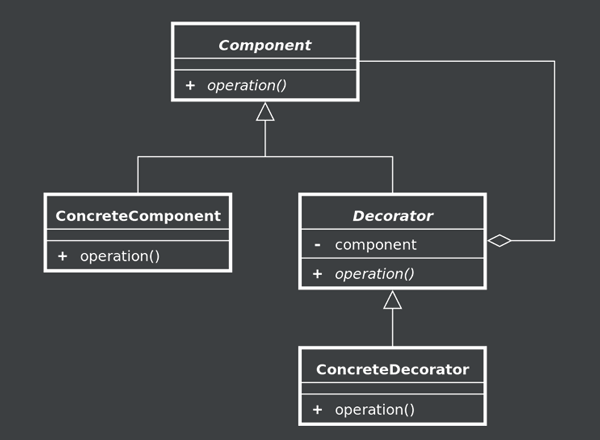

# Le Design Pattern Decorator

Simple implémentation du design pattern Decorator à travers un exemple d'un configurateur d'option pour véhicule.

## Classification

Le Decorator appartient à la famille des **design patterns structurels.**

## Définition du Gang Of Four

> Attach additional responsibilities to an object dynamically. Decorators provide a flexible alternative to subclassing for extending functionality.

Simplification de cette définition :  

Le Design Pattern Decorator permet d’ajouter dynamiquement des responsabilités à un objet existant. Cette solution apporte plus de souplesse que l’héritage.

## Diagramme UML

